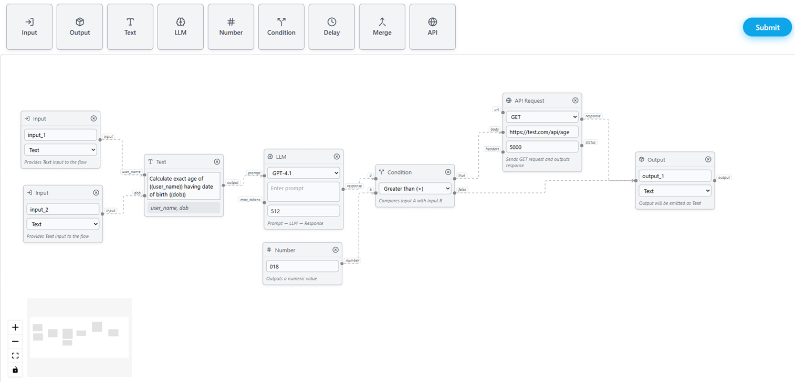

# 🚀 PipelineX — Visual Workflow & AI Pipeline Builder

PipelineX is a **full-stack visual workflow builder** that allows users to design pipelines by dragging, connecting, and configuring modular nodes.  
It combines an **interactive React Flow–based editor** with a **FastAPI backend** for structural validation, making it suitable for AI workflows, automation pipelines, and data processing graphs.

---

## 🎥 Preview

### ⚡ Visual Pipeline Builder (Demo)


### 🖼 Application Screenshot


---

## ✨ Key Features

### 🎛 Visual Pipeline Editor
- Drag-and-drop node creation  
- Connect nodes via input/output handles  
- Grid-snapped canvas with minimap & controls  
- Unified node abstraction for rapid extensibility  
- Multi-select and keyboard-driven deletion  

### 🧩 Extensible Node System
- Input  
- Output  
- Text (supports `{{variable}}` handles)  
- LLM  
- Number  
- Condition  
- Delay  
- Merge  
- API Request  

All nodes share a common base abstraction, enabling consistent styling and behavior while minimizing duplicated logic.

### 📝 Smart Text Node
- Auto-resizing text input  
- Dynamic input handles generated from `{{variable}}`  
- JavaScript-safe variable validation  
- Real-time node layout updates  

### 🔍 Backend Graph Validation
- Counts total nodes  
- Counts total edges  
- Detects whether the pipeline is a **Directed Acyclic Graph (DAG)**  
- Prevents circular dependencies in workflows  

### 🎨 Polished UI & UX
- Clean, unified design using Tailwind CSS  
- Smooth animations with Framer Motion  
- Accessible modal notifications  
- Keyboard shortcuts (Ctrl / Cmd + Enter to submit)  

---

## ⚙️ Tech Stack

| Layer | Technologies |
|------|--------------|
| Frontend | React, React Flow, Zustand, Tailwind CSS |
| Backend | FastAPI, Python, Uvicorn |
| Animations | Framer Motion |
| Tooling | Node.js, npm |

---

## 📂 Project Structure

```
PipelineX/
│
├── backend/
│   └── main.py
│
├── frontend/
│   ├── public/
│   ├── src/
│   │   ├── nodes/
│   │   ├── store/
│   │   ├── components/
│   │   ├── submit.js
│   │   ├── toolbar.js
│   │   └── App.js
│   ├── .env
│   └── package.json
│
└── README.md
```

---

## 🚀 Getting Started

### 1️⃣ Clone the Repository
```bash
git clone https://github.com/DhirajKarangale/PipelineX.git
cd PipelineX
```

---

### 2️⃣ Backend Setup (FastAPI)

```bash
cd backend
```

#### Create virtual environment
**Windows**
```bash
python -m venv venv
```

**macOS / Linux**
```bash
python3 -m venv venv
```

#### Activate environment
**Windows**
```bash
venv\Scripts\activate
```

**macOS / Linux**
```bash
source venv/bin/activate
```

#### Install dependencies & run server
```bash
pip install -r requirements.txt
uvicorn main:app --reload
```

Backend runs at: **http://localhost:8000**

---

### 3️⃣ Frontend Environment Setup

Create a `.env` file inside the **frontend** directory:

```env
REACT_APP_API_URL=http://localhost:8000
```

Replace the URL if your backend is hosted elsewhere.

---

### 4️⃣ Frontend Setup (React)

```bash
cd frontend
npm install
npm start
```

Frontend runs at: **http://localhost:3000**

---

## 🛠 How to Use

1. Open the application in your browser.  
2. Drag nodes from the toolbar onto the canvas.  
3. Connect nodes using input/output handles.  
4. Configure node properties inline.  
5. Click **Submit** (or press Ctrl / Cmd + Enter).  
6. View pipeline statistics and DAG validation in the modal.

---

## 🔮 Future Improvements

- Persist node configuration to global store  
- Execute pipelines step-by-step  
- Export / import pipeline JSON  
- Type-safe schema validation  
- Execution logs & runtime visualization  
